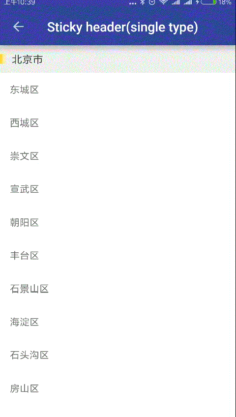
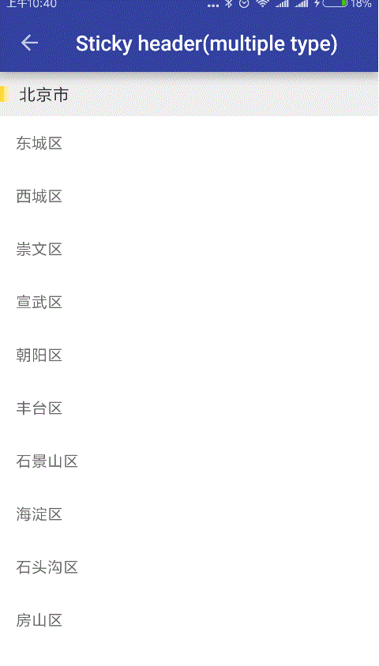
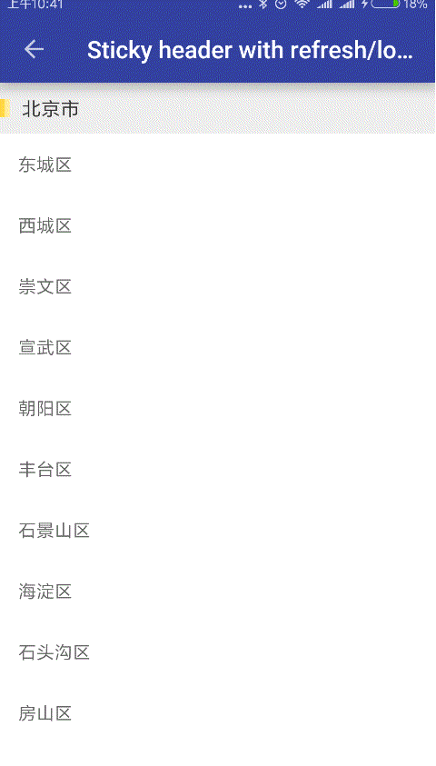
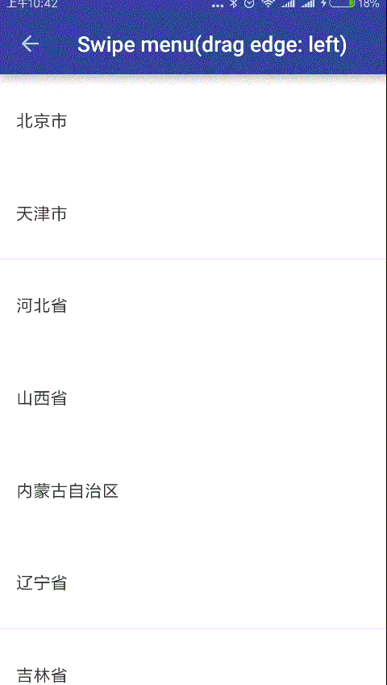
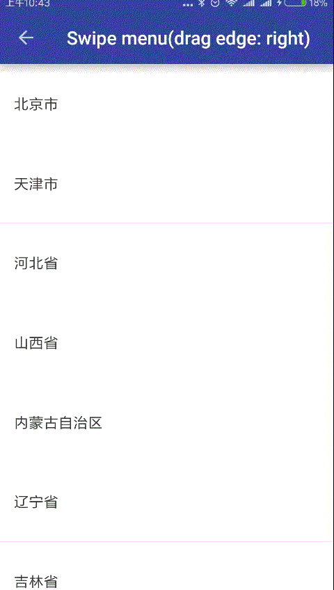
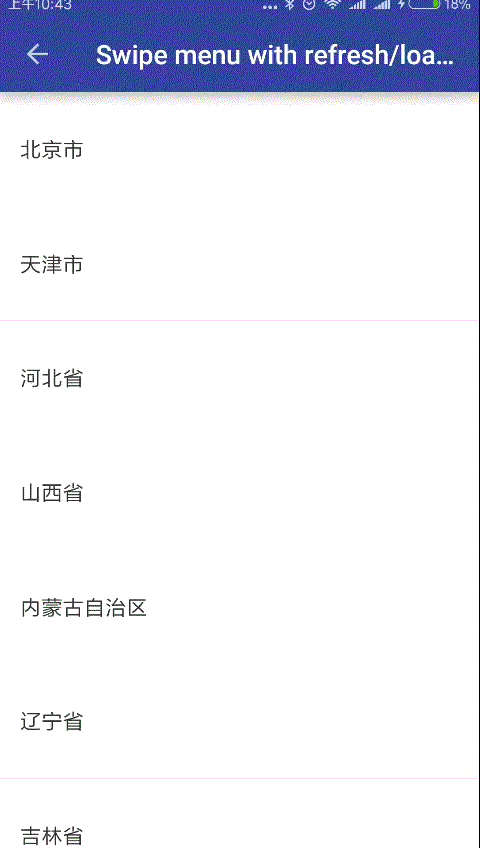
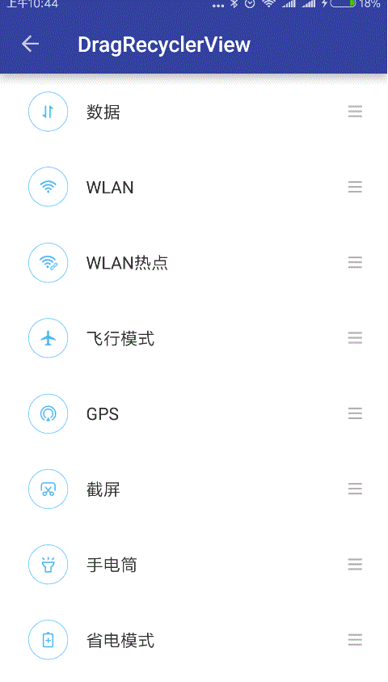

# Advanced-MVVM-Recyclerview
基于MVVM架构的RecyclerView，更少的代码，更低的耦合性

支持的功能
  
 - Sticky Header效果；实现RecyclerView Item顶部悬浮，支持多种Header样式；  
 - Swipe Menu效果：横向滑动菜单，支持左右滑动两种操作；
 - Drag 效果；
 - 下拉刷新，上拉加载更多；

# Demo  
[Demo下载](https://www.pgyer.com/ebTo)

- **StickyHeader**  
 
<div style="float:left;border:solid 1px 000;margin:5px;">
	
	
	
</div>
<div style="clear:both;"></div>
   
   
   
   
- **SwipeMenu**  
 
<div style="float:left;border:solid 1px 000;margin:5px;">
	
	
	
</div>
<div style="clear:both;"></div>  
   
   
   
- **Drag**  

<div style="float:left;border:solid 1px 000;margin:5px;">
	
</div>
<div style="clear:both;"></div>  

# Usage
  
**本项目基于MVVM架构，使用了[android-mvvm-framwork](https://github.com/wuhenzhizao/android-mvvm-framwork)框架，mvvm部分代码请参考该框架，下面主要讲RecyclerView部分的用法**

> 通过配置来启用不同的功能

```xml
<declare-styleable name="AdvancedRecyclerView">
    <attr name="refreshHeaderClass" format="string" />  // 自定义Refresh Header
    <attr name="refreshFooterClass" format="string" />  // 自定义Loader Footer
    <attr name="contentMode" format="enum"> 
        <enum name="normal" value="1" />    // 普通recyclerView
        <enum name="sticky" value="2" />    // stickyHeader效果
        <enum name="swipe" value="3" />     // swipeMenu效果
        <enum name="drag" value="4" />      // drag效果
        <enum name="indexable" value="5" />
    </attr>
    <attr name="proxy" format="reference" /> />
</declare-styleable>
``` 

StickyHeader，支持多样式
========================  

> 布局文件

```xml
<data>
    <import type="com.wuhenzhizao.view.factory.StickyItemViewFactory" />
    <import type="com.gomeos.mvvm.view.LayoutManagers" />
    <variable
        name="vm"
        type="com.wuhenzhizao.viewmodule.StickyViewModel" />
</data>

<com.wuhenzhizao.view.AdvancedRecyclerView
    xmlns:sticky="http://schemas.android.com/apk/res-auto"
    android:layout_width="match_parent"
    android:layout_height="match_parent"
    android:layout_below="@id/toolbar"
    sticky:contentMode="sticky"
    sticky:itemViewFactory="@{StickyItemViewFactory.className}"
    sticky:items="@{vm.itemList}"
    sticky:layoutManager="@{LayoutManagers.linear()}"
    sticky:proxy="@{vm.proxy}" />
```
> 绑定Stick Header点击监听
  
```java
RecyclerViewProxy proxy = new RecyclerViewProxy();
proxy.setItemHeaderClickListener(new OnItemHeaderClickListener() {
    @Override
    public void onHeaderClick(int position, long headerId) {
    		...
    }
});
```  

> 数据bean继承自StickyViewBean
 

SwipeMenu
=====================  

> 布局文件

```xml
<data>
    <import type="com.wuhenzhizao.view.factory.SwipeItemViewFactory" />
    <import type="com.gomeos.mvvm.view.LayoutManagers" />
    <variable
        name="vm"
        type="com.wuhenzhizao.viewmodule.SwipeViewModel" />
</data>

<com.wuhenzhizao.view.AdvancedRecyclerView
    xmlns:swipe="http://schemas.android.com/apk/res-auto"
    android:layout_width="match_parent"
    android:layout_height="match_parent"
    android:layout_below="@id/toolbar"
    swipe:contentMode="swipe"
    swipe:itemViewFactory="@{SwipeItemViewFactory.className}"
    swipe:items="@{vm.itemList}"
    swipe:layoutManager="@{LayoutManagers.linear()}"
    swipe:proxy="@{vm.proxy}" />
```
  
> RecyclerView Item布局
	
```
<com.daimajia.swipe.SwipeLayout
    xmlns:swipe="http://schemas.android.com/apk/res-auto"
    android:id="@+id/swipe_layout"
    android:layout_width="match_parent"
    android:layout_height="85dp"
    android:background="@android:color/white"
    swipe:clickToClose="boolean"
    swipe:drag_edge="left|right"
    swipe:show_mode="pull_out|lay_down">
    
    ...
    
</com.daimajia.swipe.SwipeLayout>
```

Drag
========================  

> 布局文件  

```xml
<data>
    <import type="com.wuhenzhizao.view.factory.DragItemViewFactory" />
    <import type="com.gomeos.mvvm.view.LayoutManagers" />
    <variable
        name="vm"
        type="com.wuhenzhizao.viewmodule.DragViewModel" />
</data>

<com.wuhenzhizao.view.AdvancedRecyclerView
    xmlns:drag="http://schemas.android.com/apk/res-auto"
    android:id="@+id/drv"
    android:layout_width="match_parent"
    android:layout_height="match_parent"
    android:layout_below="@id/toolbar"
    drag:contentMode="drag"
    drag:proxy="@{vm.proxy}"
    drag:itemViewFactory="@{DragItemViewFactory.className}"
    drag:items="@{vm.itemList}"
    drag:layoutManager="@{LayoutManagers.linear()}" />
```

> 绑定Drag事件监听
  
```java
RecyclerViewProxy proxy = new RecyclerViewProxy();
proxy.setItemDragListener(new OnItemDragListener() {
    @Override
    public void onDrag(int fromPosition, int toPosition) {
        Collections.swap(itemList, fromPosition, toPosition);
    }
});
```

Pull Refresh And Load More
==========================  
[AdvancedRecyclerView](library/src/main/java/com/wuhenzhizao/view/AdvancedRecyclerView.java)集成了[StickyHeader]，[SwipeMenu]，[Drag]，[上拉刷新，下拉加载更多]，上拉刷新，下拉加载更多通过[RefreshLayoutProxy](library/src/main/java/com/wuhenzhizao/view/RecyclerViewProxy.java)实现


```java
RecyclerViewProxy {
	...
	// 设置下拉刷新监听
	public void setPullRefreshListener(OnPullRefreshListener pullRefreshListener);
	// 设置上拉加载更多监听
	public void setLoadMoreListener(OnLoadMoreListener loadMoreListener);
	// 同时监听下拉刷新和上拉加载更多
	public void setRefreshOrLoadMoreListener(OnRefreshOrLoadMoreListener refreshOrLoadMoreListener);
	// 更详细的监听，可以实现效果
	public void setMultiChangedListener(OnMultiChangedListener multiChangedListener);
	// 设置是否启用下拉刷新
	public void setEnableRefresh(boolean enableRefresh);
	// 设置是否启用上拉加载更多
	public void setEnableLoadMore(boolean enableLoadMore);
	// 设置是否启用内容视图拖动效果
	public void setEnableHeaderTranslationContent(boolean enableHeaderTranslationContent);
	// 设置是否启用内容视图拖动效果
	public void setEnableFooterTranslationContent(boolean enableFooterTranslationContent);
	// 设置是否启用越界回弹
	public void setEnableOverScrollBounce(boolean enableOverScrollBounce);
	// 设置是否开启纯滚动模式
	public void setEnablePureScrollMode(boolean enablePureScrollMode);
	// 设置是否在列表滚动到底部时自动加载更多
	public void setEnableAutoLoadMore(boolean enableAutoLoadMore);
	// 设置是否在加载更多完成之后滚动内容显示新数据
	public void setEnableScrollContentWhenLoaded(boolean enableScrollContentWhenLoaded);
	// 设置在内容不满一页的时候，是否可以上拉加载更多
	public void setEnableLoadMoreWhenContentNotFull(boolean enableLoadMoreWhenContentNotFull);
	// 设置是否开启在刷新时禁止操作内容视图
	public void setDisableContentWhenRefresh(boolean disableContentWhenRefresh);
	// 设置是否开启在加载时禁止操作内容视图
	public void setDisableContentWhenLoading(boolean disableContentWhenLoading);
}
```  

# TODO

- [x] 代码重构以实现更良好的封装
- [ ] 增加更多的效果：indexable、expadable等


# Thanks
- [AndroidMVVM](https://github.com/gomeos/AndroidMVVM)
- [AndroidSwipeLayout](https://github.com/daimajia/AndroidSwipeLayout)
- [header-decor](https://github.com/edubarr/header-decor)
- [SmartRefreshLayout](https://github.com/scwang90/SmartRefreshLayout)  

