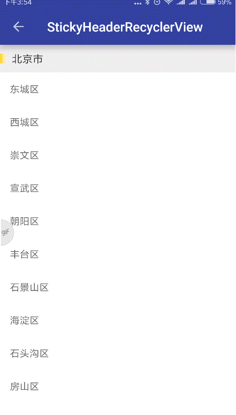
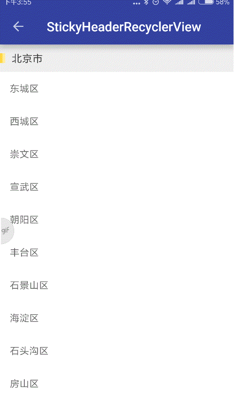
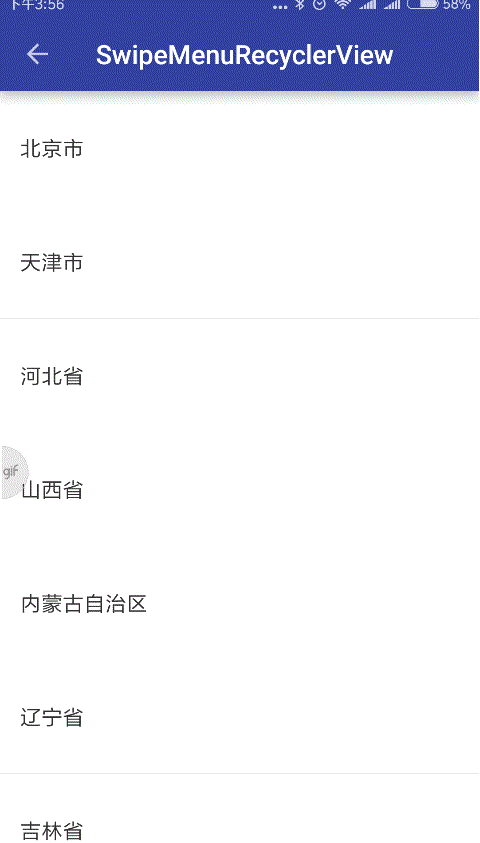

# MVVM-RecyclerView
基于MVVM架构的RecyclerView

支持的功能
  
 - Sticky Header效果；实现RecyclerView Item顶部悬浮，支持多种Header样式；  
 - Swipe Menu效果：横向滑动菜单，支持左右滑动两种操作；
 - Drag 效果；

## 预览图  

	

	

<figure class="half">
    
    
</figure>  

<figure class="half">
    
    
</figure>  

<figure class="half">
    
</figure>

