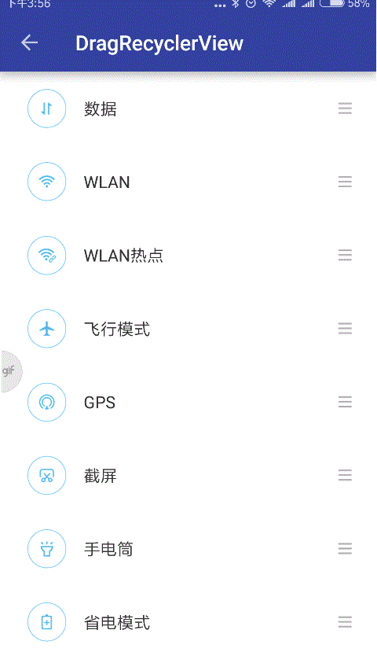

# Easy-MVVM-Recyclerview
基于MVVM架构的RecyclerView，更少的代码，更低的耦合性

支持的功能
  
 - Sticky Header效果；实现RecyclerView Item顶部悬浮，支持多种Header样式；  
 - Swipe Menu效果：横向滑动菜单，支持左右滑动两种操作；
 - Drag 效果；

# Demo  
[Demo下载](https://www.pgyer.com/ebTo)

- StickyHeaderRecyclerView 
<div style="float:left;border:solid 1px 000;margin:5px;">
	
	
</div>
<div style="clear:both;"></div>

- SwipeMenuRecyclerView  
<div style="float:left;border:solid 1px 000;margin:5px;">
	
	
</div>
<div style="clear:both;"></div>  

- DragRecyclerView
<div style="float:left;border:solid 1px 000;margin:5px;">
	
</div>
<div style="clear:both;"></div>  

# Usage
  
**本项目基于MVVM架构，使用了[android-mvvm-framwork](https://github.com/wuhenzhizao/android-mvvm-framwork)框架，mvvm部分代码请参考该框架，下面主要讲RecyclerView部分的用法** 

[StickyHeaderRecyclerView](library/src/main/java/com/wuhenzhizao/view/StickyHeaderRecyclerView.java)
========================  

```xml
<data>
    <import type="com.wuhenzhizao.view.factory.StickyItemViewFactory" />
    <import type="com.gomeos.mvvm.view.LayoutManagers" />
    <variable
        name="vm"
        type="com.wuhenzhizao.viewmodule.StickyViewModel" />
</data>

<com.wuhenzhizao.view.StickyHeaderRecyclerView
    xmlns:sticky="http://schemas.android.com/apk/res-auto"
    android:id="@+id/drv"
    android:layout_width="match_parent"
    android:layout_height="match_parent"
    android:layout_below="@id/toolbar"
    sticky:headerClickListener="@{vm.headerClickListener}"  
    sticky:itemViewFactory="@{StickyItemViewFactory.className}"
    sticky:items="@{vm.itemList}"
    sticky:layoutManager="@{LayoutManagers.linear()}" />
```

绑定Stick Header点击监听
  
```java
public ItemHeaderClickListener getHeaderClickListener() {
    return new ItemHeaderClickListener() {
        @Override
        public void onHeaderClick(View clickView, int position, long headerId) {
            StickyTestViewBean viewBean = itemList.get(position);
        }
    };
}
```  

[SwipeMenuRecyclerView](library/src/main/java/com/wuhenzhizao/view/SwipeMenuRecyclerView.java)
=====================  

- Activity布局

```xml
<data>
    <import type="com.wuhenzhizao.view.factory.SwipeItemViewFactory" />
    <import type="com.gomeos.mvvm.view.LayoutManagers" />
    <variable
        name="vm"
        type="com.wuhenzhizao.viewmodule.SwipeViewModel" />
</data>

<com.wuhenzhizao.view.SwipeMenuRecyclerView
    xmlns:sticky="http://schemas.android.com/apk/res-auto"
    android:id="@+id/drv"
    android:layout_width="match_parent"
    android:layout_height="match_parent"
    android:layout_below="@id/toolbar"
    sticky:itemViewFactory="@{SwipeItemViewFactory.className}"
    sticky:items="@{vm.itemList}"
    sticky:layoutManager="@{LayoutManagers.linear()}" />
```
  
- RecyclerView Item布局
	
```
<com.daimajia.swipe.SwipeLayout
    xmlns:swipe="http://schemas.android.com/apk/res-auto"
    android:id="@+id/swipe_layout"
    android:layout_width="match_parent"
    android:layout_height="85dp"
    android:background="@android:color/white"
    swipe:clickToClose="boolean"
    swipe:drag_edge="left|right"
    swipe:show_mode="pull_out|lay_down">
    
    ...
    
</com.daimajia.swipe.SwipeLayout>
```

[DragRecyclerView](library/src/main/java/com/wuhenzhizao/view/DragRecyclerView.java)
========================  

```xml
<data>
    <import type="com.wuhenzhizao.view.factory.DragItemViewFactory" />
    <import type="com.gomeos.mvvm.view.LayoutManagers" />
    <variable
        name="vm"
        type="com.wuhenzhizao.viewmodule.DragViewModel" />
</data>

<com.wuhenzhizao.view.DragRecyclerView
    xmlns:drag="http://schemas.android.com/apk/res-auto"
    android:id="@+id/drv"
    android:layout_width="match_parent"
    android:layout_height="match_parent"
    android:layout_below="@id/toolbar"
    drag:callback="@{vm.dragCallBack}"
    drag:itemViewFactory="@{DragItemViewFactory.className}"
    drag:items="@{vm.itemList}"
    drag:layoutManager="@{LayoutManagers.linear()}" />
```

绑定Drag事件监听
  
```java
public ItemDragCallBack getDragCallBack(){
	return new ItemDragCallBack() {
	    @Override
	    public void onDrag(int fromPositon, int toPosition) {
	        Collections.swap(itemList, fromPositon, toPosition);
	    }
	};
}
``` 

# TODO

- [x] 代码重构以实现更良好的封装
- [x] 增加对下拉刷新，加载更多的支持
- [ ] 增加更多的效果：fast index、expadable等


# Thanks
- [AndroidMVVM](https://github.com/gomeos/AndroidMVVM)
- [AndroidSwipeLayout](https://github.com/daimajia/AndroidSwipeLayout)
- [header-decor](https://github.com/edubarr/header-decor)
- [SmartRefreshLayout](https://github.com/scwang90/SmartRefreshLayout)
